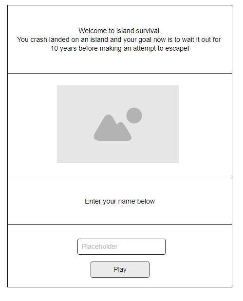
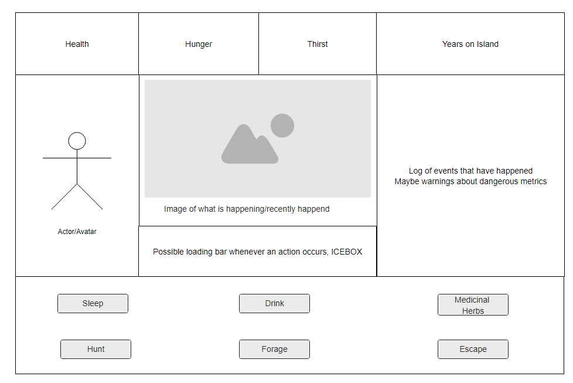

# Island Survival (Tomagotchi)
==Wireframes==

<h2>==Goal==</h2>
Create a game where you crashed on an island and have to survive by managing health, thirst, and hunter to 10 years before escaping to win.

<h2>==Technologies Used==</h2>
HTML, CSS, Javascript, jQuery, DOM Manipulation

<h2>==Approach Taken==</h2>
<li>Javascript code was initially written using a player object with many methods to interact with DOM for MVP, later changed to using classes for a bonus feature </li>

<h2>==User Stories==</h2>
<li>Player/user is presented with a welcome screen with basic instructions and name entry before Play </li>
<li>After beginning the game, player sees several metrics on the top bar that they have to manage, keeping Health above 0 and Thirst/Hunger Levels lower than 10. </li>
<li>Player has several buttons on the bottom of the game screen that will call various functions that affect metrics </li>
<li>As time progresses, Health will decrease and Thirst/Hunger will increase at a set interval</li> 
<li>Some buttons will have both positive and negative effects </li>
<li>Trying to escape before reaching the minimum  10 years will punish the player. </li>
<li>Failing a metric check (exceeding metric limit) will be a game over. </li>
<li>Successful escape will generate a win screen</li>

<h2>==IceBox==</h2>
<li>Update avatar at certain milestones -</li>
     <li>Add effect to signify aging to new avatar</li>
<li>Animate various activities -</li>
<li>When a metric is changed/modified, flash the respective metric to alert player something happened. -</li>
<li>On Game Over loss or win, add option to restart the game -</li>
<li>Add game over screen/avatar -</li>
<li>On game over, disable button functions so that they do nothing when game ends -</li>
<li>Add event log to keep track of events/actions -</li>
        <li>Colorize positive/negative events-</li>
<li>Add loading bar after an action button is pressed</li>
<li>Change javascript from using an object for the game to using classes-</li>
<li>Hovering over each button will give a tooltip that says what it will affect -</li>
<li>As player reaches certain age milestones, time will pass faster and thus metrics will decrease/increase faster - </li>
<li>Add "bars" to metrics in addition to the textual metrics -</li>
<li>Add nicer looking font</li>
<li>Wilson volleyball easter egg game leveraging classes-</li>
<li>Unique volleyball ending-</li>
<li>Avatar selection option, as Bart or Lisa, with unique animations -</li>

<h2>==Other Notes/Spoilers==</h2>
<li>In trying to "give birth to a baby" or "add another survivor to the island" I couldn't figure/plan out how to stylize the game board for two characters at the same time. So the conversion of the Javascript file from using an object to classes seemed wasted. Instead I implemented another idea where you play stripped down version as a volleyball if your name is "Wilson". So the "full game" is actually extended(a child) from the volleyball class while the stripped version is the parent class with minimal functionality. Which I think is a bad idea because now the  "Player" class is a child of a "Volleyball". Player child class has many more functions and abilities as well as overwrites some parent class functions</li>